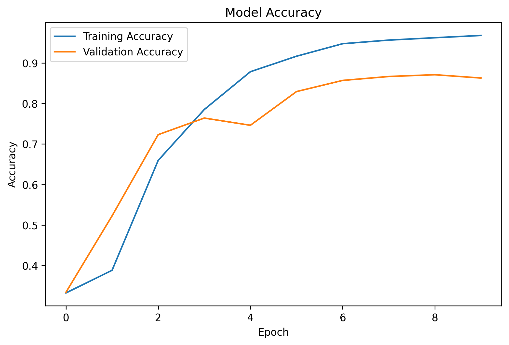

# 😊 Emotion Detection from Text using Artificial Neural Networks (ANN)

## 📌 Project Overview

Emotion Detection from Text is a Deep Learning and Natural Language Processing (NLP) project that automatically identifies the emotion expressed in a given sentence. The model is trained using an Artificial Neural Network (ANN) built with TensorFlow and Keras.

The system classifies text into one of the following six emotions:

- 😊 Joy
- 😢 Sadness
- 😠 Anger
- 😨 Fear
- ❤️ Love
- 😲 Surprise

This project demonstrates the complete Deep Learning pipeline, including data preprocessing, text tokenization, model training, evaluation, and deployment through a Streamlit web application.

---

# 🚀 Features

- Emotion prediction from custom text
- Deep Learning model using ANN
- NLP preprocessing and tokenization
- Multi-class emotion classification
- Model evaluation using Accuracy, Precision, Recall, and F1-score
- Confusion Matrix visualization
- Training and Validation Accuracy/Loss graphs
- Interactive Streamlit web application
- Saved trained model for future predictions

---

# 🛠️ Technologies Used

| Category | Tools |
|----------|-------|
| Language | Python |
| Deep Learning | TensorFlow, Keras |
| NLP | Tokenizer, Padding |
| Data Processing | Pandas, NumPy |
| Machine Learning | Scikit-learn |
| Visualization | Matplotlib, Seaborn |
| Deployment | Streamlit |
| Development Environment | Google Colab, VS Code |
| Version Control | Git & GitHub |

---

# 📂 Project Structure

```
Emotion-Detection-Using-ANN/
│
├── Emotion_Detection_Using_ANN.ipynb
├── app.py
├── emotion_detection_model.h5
├── tokenizer.pkl
├── label_encoder.pkl
├── requirements.txt
├── README.md
├── LICENSE
├── .gitignore
├── accuracy.png
├── loss.png
├── confusion_matrix.png
└── screenshots/
```

---

# 📊 Dataset

**Dataset Name**

Emotion Dataset for NLP

The dataset contains thousands of text samples labeled with one of six emotions.

### Emotion Classes

- Joy
- Sadness
- Anger
- Fear
- Love
- Surprise

---

# ⚙️ Project Workflow

```
Dataset
      ↓
Data Cleaning
      ↓
Label Encoding
      ↓
Tokenization
      ↓
Padding
      ↓
Train-Test Split
      ↓
ANN Model
      ↓
Training
      ↓
Evaluation
      ↓
Emotion Prediction
      ↓
Streamlit Deployment
```

---

# 🧠 Model Architecture

```
Input Text
      ↓
Embedding Layer
      ↓
GlobalAveragePooling1D
      ↓
Dense Layer (64, ReLU)
      ↓
Dropout (0.3)
      ↓
Dense Layer (32, ReLU)
      ↓
Output Layer (Softmax - 6 Classes)
```

---

# 📈 Model Evaluation

The trained model was evaluated using multiple performance metrics.

Evaluation Metrics:

- Accuracy
- Precision
- Recall
- F1-Score
- Confusion Matrix

The model achieved high accuracy in classifying six different emotions from textual input.

---

# 📊 Training Results

## Accuracy Graph



---

## Loss Graph


---

## Confusion Matrix


---

# 💻 Streamlit Web Application

The project also includes a simple Streamlit application where users can enter any sentence and instantly receive the predicted emotion along with the confidence score.

### Example Inputs

```
I am very happy today.
```

Prediction

```
😊 Joy
```

---

```
I feel extremely sad.
```

Prediction

```
😢 Sadness
```

---

```
He made me angry.
```

Prediction

```
😠 Anger
```

---

# 📸 Screenshots

## Home Page

> Add your screenshot here

```
screenshots/home.png
```

---

## Prediction Page

> Add your screenshot here

```
screenshots/prediction.png
```

---

# ▶️ How to Run

### Clone Repository

```bash
git clone https://github.com/YOUR_USERNAME/Emotion-Detection-Using-ANN.git
```

---

### Install Dependencies

```bash
pip install -r requirements.txt
```

---

### Run Streamlit App

```bash
streamlit run app.py
```

---

# 📦 Requirements

- Python 3.10+
- TensorFlow
- Streamlit
- Pandas
- NumPy
- Scikit-learn
- Matplotlib
- Seaborn

---

# 🎯 Applications

- Mental Health Monitoring
- Customer Feedback Analysis
- Chatbots
- Social Media Analytics
- Emotion-aware AI Systems
- Sentiment Understanding

---

# 🔮 Future Improvements

- Replace ANN with LSTM/Bi-LSTM for improved performance
- Fine-tune transformer models such as BERT
- Add multilingual emotion detection
- Deploy on Streamlit Cloud
- Integrate speech-to-text emotion detection
- Develop a REST API using Flask/FastAPI

---

# 👩‍💻 Author

**Sneha Verma**

B.Tech Computer Science (Artificial Intelligence)

Noida Institute of Engineering and Technology (NIET), Greater Noida

GitHub:
https://github.com/SnehaVerma-14

---

## ⭐ If you found this project useful, consider giving it a Star!
